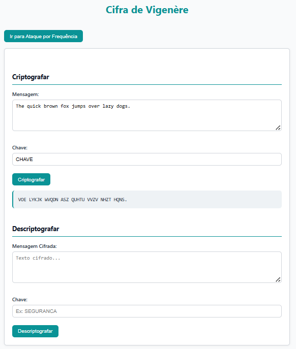
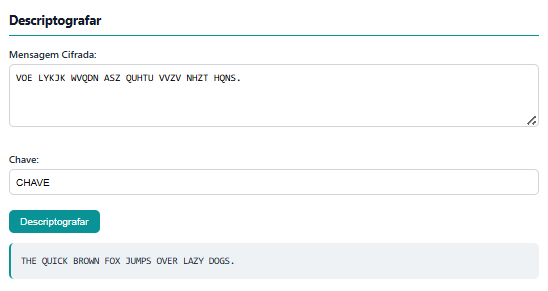
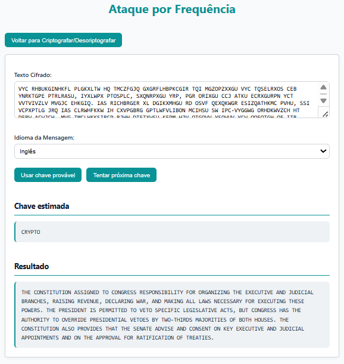

# Cifra de Vigenère – Segurança Computacional (CIC0201)

Este projeto implementa uma ferramenta completa para estudo e demonstração prática da **cifra de Vigenère**, no contexto da disciplina **CIC0201 – Segurança Computacional**, com:

- Cifrador e decifrador com chave repetitiva  
- Ataque por análise de frequência com **método de Kasiski**  
- Interface web interativa via **Flask**  
- Modo alternativo de execução via **terminal (modo texto)**

---

## O que é a Cifra de Vigenère?

A Cifra de Vigenère é um método clássico de criptografia por substituição polialfabética. Utiliza-se uma palavra-chave para aplicar diferentes deslocamentos nas letras da mensagem original, o que dificulta a quebra usando análise de frequência simples. Por muito tempo foi considerada indecifrável, mas hoje é amplamente estudada em disciplinas de segurança da informação pela importância histórica e conceitual.

## Como executar

### Criptografia

A interface permite inserir a mensagem original e a chave desejada para gerar o texto cifrado usando a cifra de Vigenère:

<p align="center">
  
</p>

---

### Descriptografia

Inserindo o texto cifrado e a chave, a aplicação retorna a mensagem original descriptografada corretamente:

<p align="center">
  
</p>

---

### Ataque por Frequência

Utilizando o método de Kasiski e análise de frequência da língua, a aplicação tenta estimar a chave original e decifrar a mensagem sem conhecê-la:

<p align="center">
  
</p>

### Execução com interface web

```bash
python app/main.py
```

Acesse no navegador:  
`http://localhost:5000`

A interface web inclui:

- Aba para **criptografar** e **descriptografar** mensagens com uma chave  
- Aba separada para o **ataque de análise de frequência**  
- Retorno imediato dos resultados na mesma tela  
- Preservação dos dados entre envios

---

## Estrutura do Projeto

```plaintext
seguranca-computacional-vigenere/
├── app/                         # Código da aplicação
│   ├── __init__.py              # Transforma em módulo
│   ├── main.py                  # Flask app principal
│   ├── src/                     # Módulos de cifra e ataque
│   │   ├── cifrador_decifrador.py
│   │   └── ataque_recuperador_chave.py
│   ├── templates/               # HTMLs do Flask
│   │   ├── index.html
│   │   └── ataque.html
│   └── static/                  # CSS
│       └── style.css
├── tests/                       # Testes com pytest
├── docs/                        # Documentação e PDFs
│   └── CIC0201-2023-1-Trab1-Proposta.pdf
├── screenshots/                 # Imagens usadas no README
│   ├── img1.png                 # Criptografar
│   ├── img2.png                 # Descriptografar
│   └── img3.png                 # Ataque
├── exemplos.txt                 # Exemplos de uso ou testes
├── requirements.txt             
├── README.md                    
└── .gitignore
```

---

## Pré-requisitos

- Python **3.8+**
- Pip (gerenciador de pacotes)
- Bibliotecas:
  - `Flask` (interface web)
  - `pytest` (caso deseje rodar os testes)

Para instalar as dependências:

```bash
pip install flask pytest
```

---

## Referências

- [Kasiski Examination – Wikipedia](https://en.wikipedia.org/wiki/Kasiski_examination)
- Frequência de letras em [Português](https://pt.wikipedia.org/wiki/Frequ%C3%AAncia_das_letras)
- Frequência de letras em [Inglês](https://en.wikipedia.org/wiki/Letter_frequency)
- Aula e vídeo da disciplina CIC0201 – Universidade de Brasília

---